## **TWC  Vending  Machine**

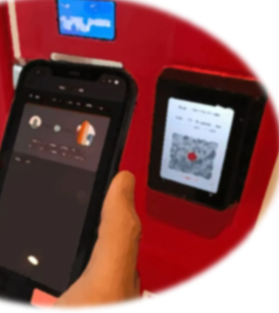

**Synoposis:**

To automate the creation of a Vending Maching (VM) in the TWC Club to dispense cannablis to club members that have
been check criters to allow to dispense.  This will reguate who is allow to legal dispense will allow profits for
the club.  This is a simplistic prototype for the outline of staring the business .  Plans are evanually to expand
the vending machine to offer other products and functions.

SPDX-License-Identifer: MIT (Open Source)

The Starting file provided for this challenge contains a prama for solidity version 0.811.

This coding will do the following:

1. Define Contract
2. Define-State Varibles: owner & balance
3. Function to Purchase: able to purchase, to restock vending machine & get balance in VM
4. Constructor: set ownder, set balance of VM to start

Coding:

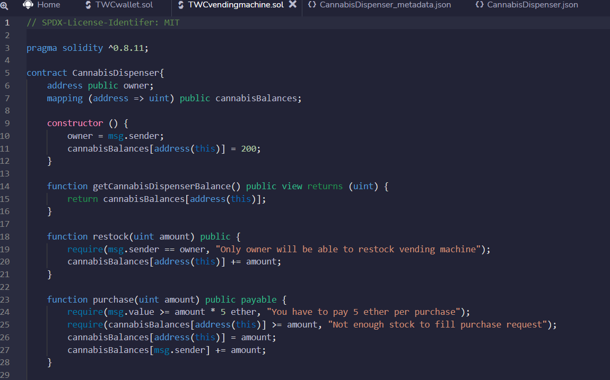

Compile & Deploy:

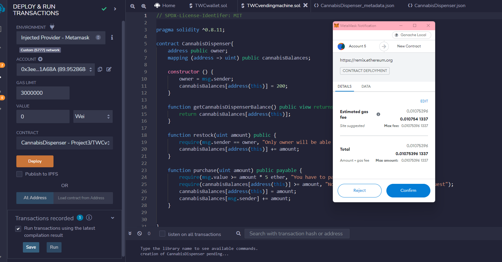

Sucess:

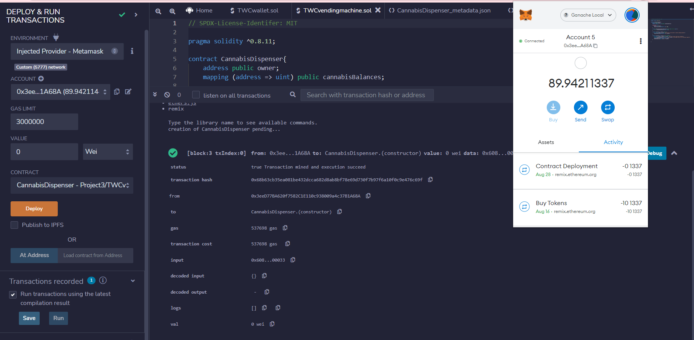

Test Ganache with 1 purchase:

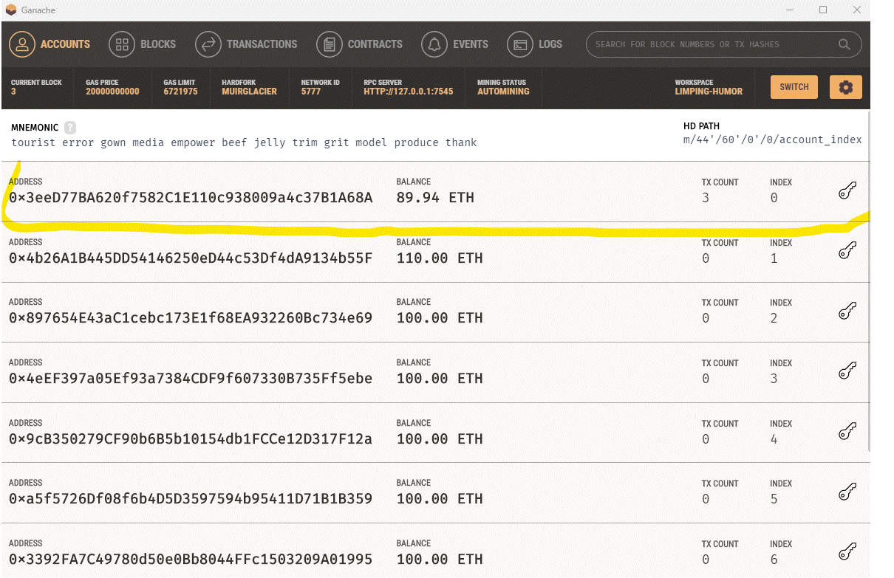

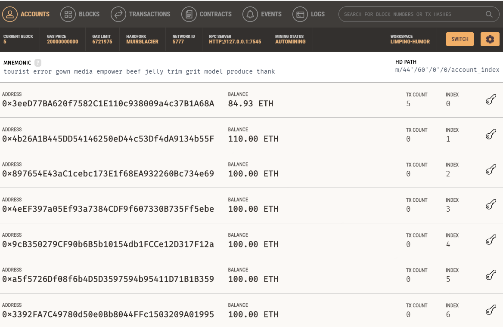

# Testing

State Varibles & Functions:

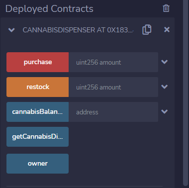

Checking starting balance:

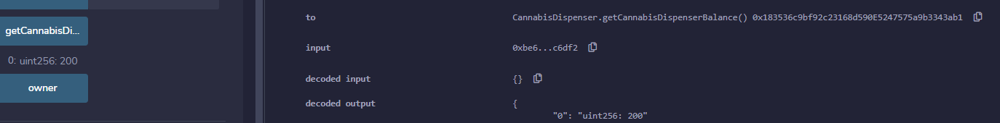

Owner:

0x3eeD77BA620f7582C1E110c938009a4c37B1A68A

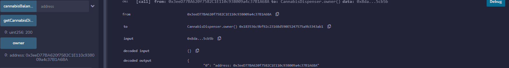

Test Purchase 1 item for 5 ether:

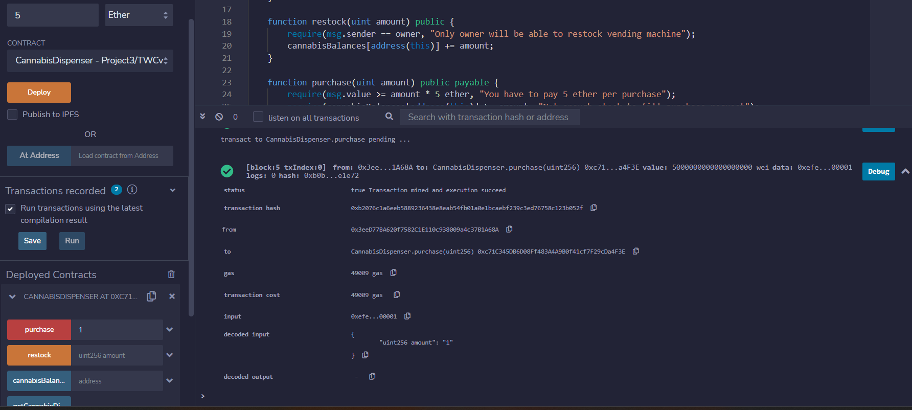

Test Account Balance:

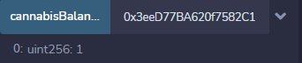

Test Restock:

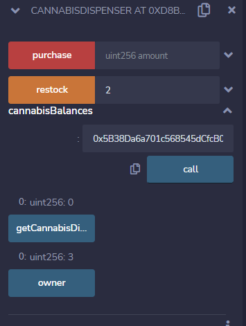

---

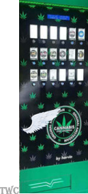
