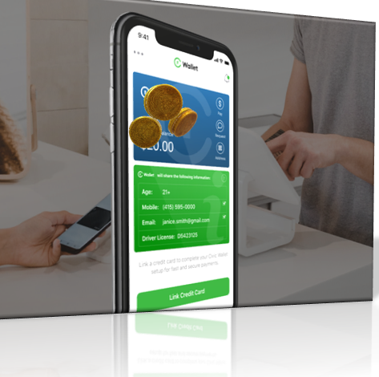
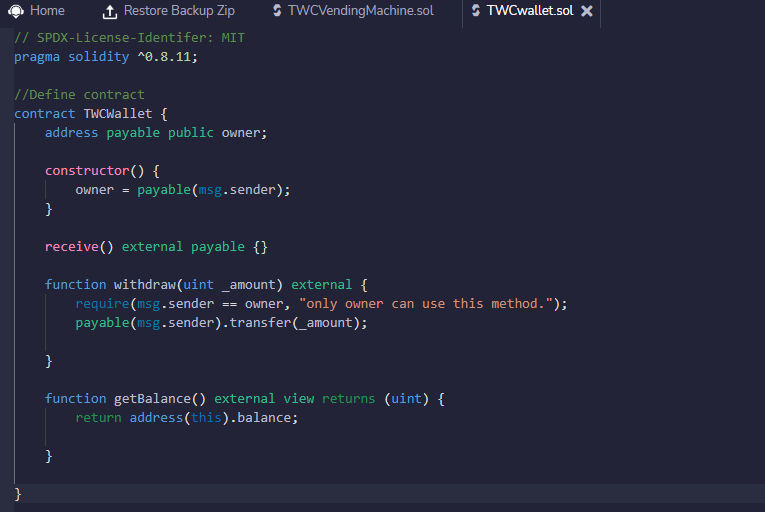
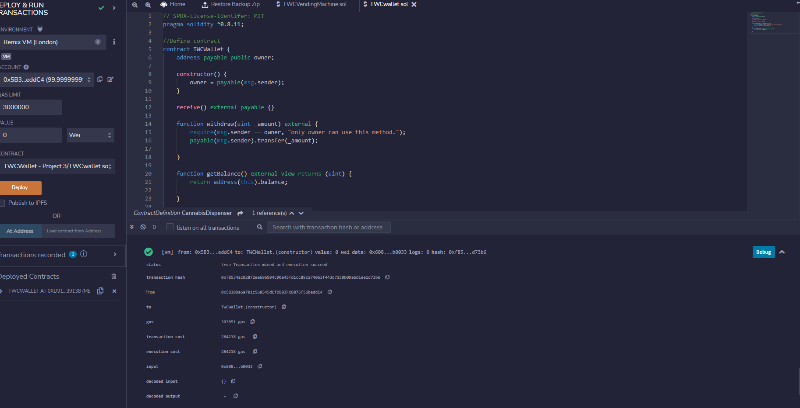
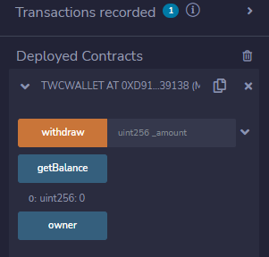
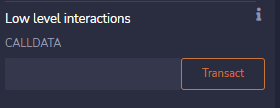
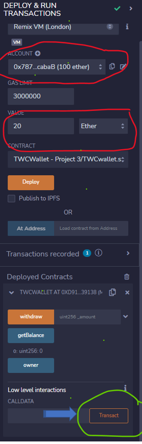
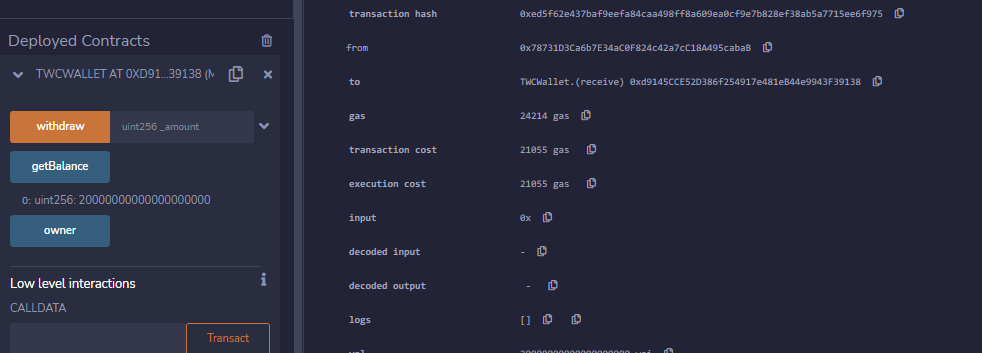
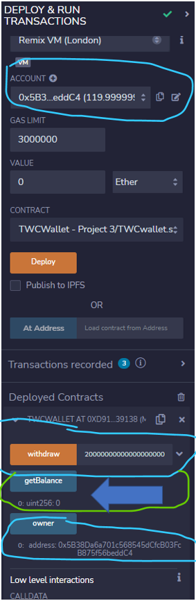
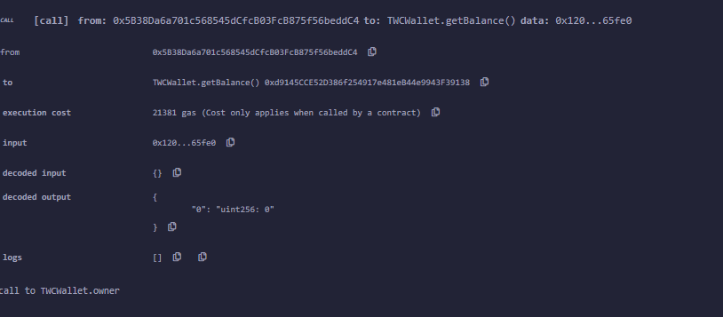
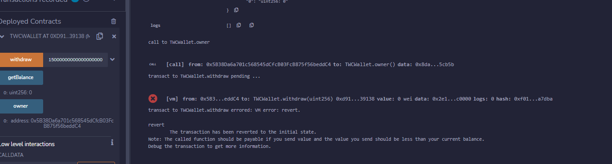

## **TWC  Wallet**

#### **Synoposis:**

To create an ETH Wallet as a prototype as for the planning of opeing the business.  In the future add other functions
as the club opens for busniess.  This will be used for purchases in the club as food, drinks etc.

Using a solidity smart contract

The Starting file provided for this challenge contains a pragma for solidity version 0.8.11.

**Varibles:** owner (made function so only owner can withdraw)

**Functions:**

1. getBalance()
2. receive() -allows to receive ether
3. withdraw() - owner can withdraw ether

- allows to receive ether/funds
- allows to receive ether/funds

Using Remix

Coding:

Coding & Deploy:

**Sucess deploy contract & checking starting with zero balance:**

# Testing

Low Level interations:

* **Low** **level** **interactions** are used to send funds or calldata or funds & calldata to a contract through the receive () or fallback () function. Examples of **low** **level** functions are call and delegate call.
* In this instance creates a transaction to send ether in to the function.

Account- Picked account taking ether from.

Valve- charged 20 ether

CallDATA- hit to withdraw from their account

Worked & getBalance function hit to show took to get balance: (defaulted to Wei)

Test: Put Owner account to withdraw amout and correctly now show zero balance:

Test to withdraw zero balance on correctly failed:

Testing completed for prototype

---
